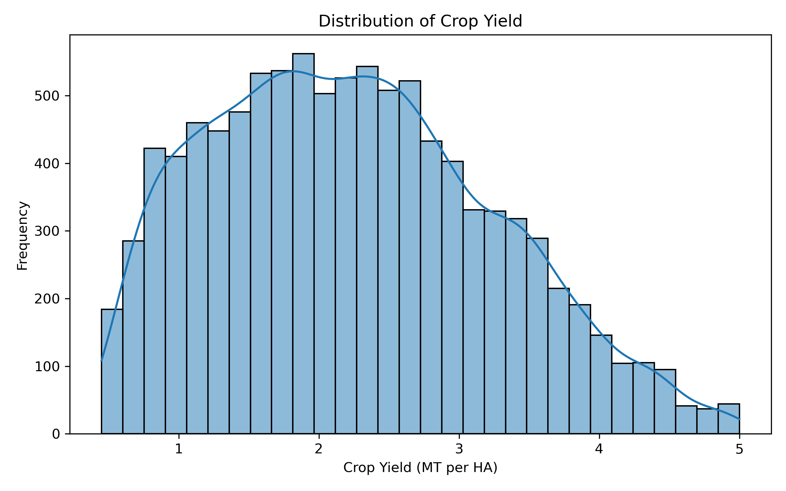
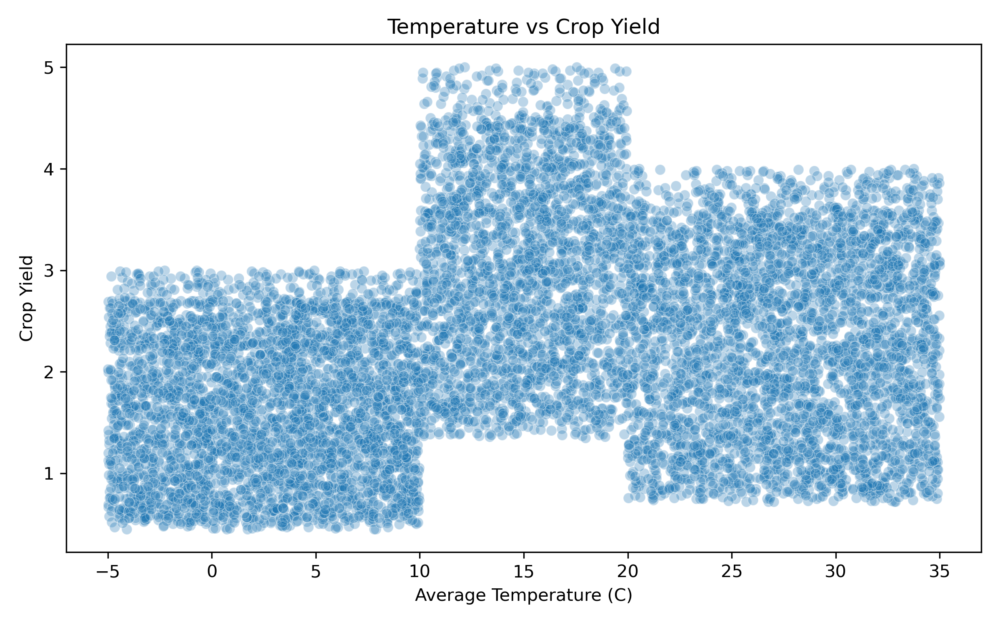
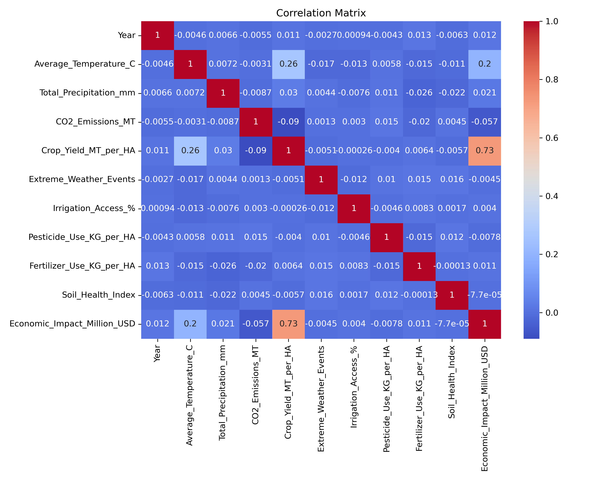

# Climate Factors and Crop Yield Analysis

## Overview

This project explores the relationship between climate factors and crop yield using exploratory data analysis.

The primary goal is not only to identify patterns in the data, but also to critically examine whether the observed relationships reflect meaningful real-world dynamics.

Through careful visualization and interpretation, this project highlights both insights and limitations within the dataset.

## Why This Project Matters

Understanding the relationship between climate factors and agricultural productivity is important for addressing challenges related to food security and environmental change.

This project demonstrates how data analysis can be used not only to identify patterns, but also to critically evaluate the reliability and limitations of data when making real-world interpretations.

## Objectives

- Understand the distribution of crop yield
- Examine relationships between climate variables and crop yield
- Analyze differences across crop types and regions
- Evaluate the role of agricultural inputs such as irrigation and fertilizer
- Critically assess the validity and limitations of the dataset

## Methodology

The analysis is conducted using exploratory data analysis techniques, including:

- Distribution analysis
- Scatter plots for relationship exploration
- Grouped comparisons by crop type and region
- Correlation analysis
- A simple baseline linear regression model

The focus is on identifying patterns and interpreting results rather than building a highly optimized predictive model.

## Dataset

The dataset contains 10,000 observations and 15 variables related to climate conditions, agricultural inputs, and crop yield.

Key variables include:

- `Crop_Yield_MT_per_HA` (target)
- `Average_Temperature_C`
- `Total_Precipitation_mm`
- `CO2_Emissions_MT`
- `Irrigation_Access_%`
- `Fertilizer_Use_KG_per_HA`

The dataset is clean and contains no missing values, enabling direct exploratory analysis.

## Research Questions

This project is guided by the following research questions:

- How are key climate variables, such as temperature and precipitation, associated with crop yield?
- Do these relationships differ across crop types and regions?
- To what extent do agricultural inputs such as irrigation and fertilizer relate to crop yield?

These questions are explored through exploratory data analysis, focusing on identifying patterns rather than making causal claims.

## Results Visualization

### Crop Yield Distribution

### Temperature vs Crop Yield

### Correlation Matrix

## Key Findings

- Crop yield shows a moderately right-skewed distribution, with most values concentrated between approximately 1.5 and 3.5 MT per HA.
- Climate variables such as temperature show weak to moderate relationships with crop yield.
- Precipitation and other environmental variables show little to no clear association with yield.
- Crop type and region do not significantly differentiate yield distributions, as their patterns are nearly identical across groups.
- Irrigation access and fertilizer use show no strong relationship with crop yield.
- Economic impact shows a strong correlation with yield, suggesting a derived relationship.
- The baseline linear regression model shows very low predictive performance after removing the leakage-related variable, confirming that the dataset has limited explanatory power.

## Interpretation & Insight

The analysis suggests that many expected relationships, such as the influence of climate factors or agricultural inputs on crop yield, are weak or absent.

Additionally, the uniformity across crop types and regions indicates that the dataset may not fully capture real-world variability.

This raises the possibility that the dataset is either simplified or artificially generated.

The optional linear regression model supports this interpretation. After removing `Economic_Impact_Million_USD` to avoid data leakage, the model showed very low predictive performance, reinforcing the conclusion that most variables have limited explanatory power in this dataset.

As a result, findings should be interpreted with caution, and the project emphasizes the importance of critically evaluating data rather than accepting patterns at face value.

## Limitations

- The dataset shows unusually uniform patterns across multiple variables.
- Key relationships expected in real-world agriculture are weak or missing.
- Some variables, such as economic impact, may be derived rather than independently measured.
- The dataset may be synthetic or pre-processed.
- The modeling results are limited by the apparent structure of the dataset and should not be interpreted as evidence of real-world predictive performance.

These limitations restrict the ability to draw real-world conclusions.

## Project Structure

    project-1-climate-crop-yield/
    ├── notebooks/
    │   ├── 01_data_understanding.ipynb
    │   ├── 02_data_cleaning.ipynb
    │   ├── 03_eda.ipynb
    │   └── 04_optional_modeling.ipynb
    ├── data/
    │   ├── raw/
    │   └── processed/
    ├── outputs/
    │   ├── figures/
    │   └── tables/
    ├── docs/
    └── src/

## Tools

- Python
- pandas
- matplotlib
- seaborn
- scikit-learn
- Jupyter Notebook / VS Code

## How to Run

Install dependencies:

    pip install -r requirements.txt

Run the notebooks in the following order:

1. `01_data_understanding.ipynb`
2. `02_data_cleaning.ipynb`
3. `03_eda.ipynb`
4. `04_optional_modeling.ipynb`

## Final Note

This project emphasizes careful interpretation, structured analysis, and critical thinking.

Rather than focusing solely on finding strong relationships, it highlights the importance of understanding data limitations and avoiding over-interpretation.

This approach reflects a research-aware mindset in applied data science.